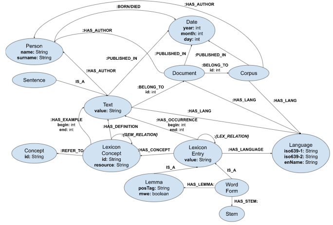

# Linked Linguistic Knowledge Graph

## Table of contents
- [Linguistic sub-graph](#linguistic-sub-graph)
- [Date sub-graph](#date-sub-graph)
- [Author sub-graph](#author-sub-graph)
- [Corpus sub-graph](#corpus-sub-graph)
- [Example sub-graph](#example-sub-graph)

## Premise

The principal objectives of ***Linked Linguistic Knowledge Graph*** are to **reorganize** and **link** the content of [Linguistic Knowledge Graph](https://ceur-ws.org/Vol-3365/short7.pdf) and [Etymological Wordnet](http://www.lrec-conf.org/proceedings/lrec2014/pdf/1083_Paper.pdf); as for the former aim, we adopt the lexicon model for ontolgies [*lemon*](https://www.w3.org/2016/05/ontolex/), while entities have been linked manually.

### Entities

| Schema | Graphical representation | Data | 
|-----|---------|---------|
|Word|LexiconEntry|*not specified*|
|Lemma|Lemma|Lemma|
|InflectedWord|WordForm|InflectedWord|
|Stem|Stem|*missing*|
|Concept|Concept|*missing*|
|LexiconConcept|LexiconConcept|LexiconConcept|
|Text|Text|Text|
|Sentence|Sentence|*missing*|
|Document|Document|Document|
|Corpus|Corpus|Corpus|
|TemporalSpecification|Date|*not specified*|
|TimePoint|Date|TimePoint|
|TemporalInterval|Date|TemporalInterval| 
|Person|Person|Person|
|Language|Language|*missing*|
|Category|*missing*|*missing*|
|*missing*|*missing*|Occupation|

### Relations

| Schema | Graphical representation | Data | 
|-----|---------|---------|
|Sentence IS_A Text|Sentence IS_A Text|*not specified*|
|Lemma $\cup$ InflectedWord IS_A Word |Lemma $\cup$ WordForm IS_A LexiconEntry|*not specified*|
|Text BELONG_TO Document|*unaltered*|*unaltered*|
|Document BELONG_TO Corpus|*unaltered*|Document HAS_CORPUS Corpus|
|Corpus BELONG_TO Category|*missing*|*missing*|
|Word HAS_OCCURENCE Text|LexiconEntry HAS_OCCURENCE Text|InflectedWord HAS_OCCURENCE Text|
|Word {LEX_RELATION} Word|LexiconEntry {LEX_RELATION} LexiconEntry|*missing*|
|Word HAS_LEMMA Lemma|WordForm HAS_LEMMA Lemma|InflectedWord HAS_LEMMA Lemma|
|Word HAS_CONCEPT LexiconConcept|LexiconEntry HAS_CONCEPT LexiconConcept|Lemma $\cup$ InflectedWord HAS_CONCPET LexiconConcept|
|LexiconConcept HAS_EXAMPLE Text|*unaltered*|*unaltered*|
|LexiconConcept HAS_DEFINITION Text|*unaltered*|*unaltered*|
|LexiconConcept REFER_TO Concept|LexiconConcept REFER_TO Concept|*missing*|
|LexiconConcept {SEM_RELATION} LexiconConcept|LexiconConcept {SEM_RELATION} LexiconConcept|LexiconConcept HAS_SUBCLASS LexiconConcept|
|Text $\cup$ Document $\cup$ Corpus PUBLISHED_IN TemporalSpecification|Text $\cup$ Document $\cup$ Corpus PUBLISHED_IN Date|Text $\cup$ Document $\cup$ Corpus PUBLISHED_IN TemporalSpecification|
|Text $\cup$ Document $\cup$ Corpus HAS_AUTHOR Person|*unaltered*|*unaltered*|
|Person BORN TemporalSpecification|Person BORN Date|*missing*|
|Person DIED TemporalSpecification|Person DIED Date|*missing*|
|TimeInterval startTime TimePoint|*not specified*|TimeInterval startTime TimePoint|
|TimeInterval endTime TimePoint|*not specified*|TimeInterval endTime TimePoint|
|Text $\cup$ Document $\cup$ Corpus $\cup$ Word HAS_LANGUAGE Language|Text $\cup$ Document $\cup$ Corpus $\cup$ LexiconEntry HAS_LANGUAGE Language|*missing*|
|*not specified*|WordForm HAS_STEM Stem|*missing*|
|*not specified*|*unspecified*|LexiconConcept SAME_AS LexiconConcept|
|Document HAS_CORPUS Corpus|Document BELONG_TO Corpus|Document HAS_CORPUS Corpus|

  
Linguistic Knowledge Graph

  
Linked Linguistic Knowledge Graph

### General purpose prefixes
**rdf** : <http://www.w3.org/1999/02/22-rdf-syntax-ns#>   
**rdfs** : <http://www.w3.org/2000/01/rdf-schema#>   
**owl** : <http://www.w3.org/2002/07/owl#>  
**dct** : <http://purl.org/dc/terms/>  
**xsd** : <http://www.w3.org/2001/XMLSchema#>  

## Linguistic sub-graph

### Prefixes
**ontolex** : <http://www.w3.org/ns/lemon/ontolex#>   
**lexinfo** : <http://www.lexinfo.net/ontology/2.0/lexinfo#>    
**vartrans** : <http://www.w3.org/ns/lemon/vartrans#>  

  
Linguistics sub-graph

### Entities
| LKG | L-LKG |
|-----|---------|
|LexiconEntry, WordForm|[ontolex:LexicalEntry](https://www.w3.org/2016/05/ontolex/#lexical-entry-class) |
|Lemma|ontolex:LexicalEntry [ontolex:canonicalForm](https://www.w3.org/2016/05/ontolex/#canonical-form-object-property) [ontolex:Form](https://www.w3.org/2016/05/ontolex/#form-class)|
|LexiconConcept|[ontolex:LexicalSense](https://www.w3.org/2016/05/ontolex/#lexicalsense-class) |
|Concept|[ontolex:LexicalConcept](https://www.w3.org/2016/05/ontolex/#lexical-concept-class) |
|Stem|*deprecated*|
|Language|[dct:LinguisticSystem](http://purl.org/dc/terms/LinguisticSystem)|

| Etymological Wordnet | L-LKG |
|-----|---------|
|:word|ontolex:LexicalEntry|
|:language|dct:LinguisticsSystem|

### Properties

| LKG | L-LKG |
|-----|---------|
|**(Entity OR Relation) property: range**| **subject predicate object**  |
|(Lemma) posTag: string| ontolex:Form [lexinfo:partOfSpeech lexinfo:PartOfSpeech](https://www.w3.org/2016/05/ontolex/#morphosyntactic-description) | 
|(Lemma) mwe: boolean| [ontolex:MultiwordExpession](https://www.w3.org/2016/05/ontolex/#multiword-expression-class) rdfs:subClassOf ontolex:LexicalEntry|
|(Lemma) value: string| ontolex:LexicalEntry ontolex:canonicalForm ontolex:Form [ontolex:writtenRep](https://www.w3.org/2016/05/ontolex/#written-representation-datatype-property) rdf:langString|
|(LexiconConcept) resource: string|ontolex:LexicalSense [dct:source](    http://purl.org/dc/terms/source) rdfs:Resource|
|(Language) enName: string|dct:LinguisticSystem rdfs:label rdfs:Literal|
|(Language) iso639-1: string|dct:LinguisticSystem :iso63911 rdfs:Literal |
|(Language) iso639-2: string|dct:LinguisticSystem :iso63921 rdfs:Literal |
|(LexiconEntry) value: string|ontolex:LexicalEntry rdfs:label rdfs:Literal |
|(LexiconConcept) alias: string|ontolex:LexicalSense rdfs:label rdfs:Literal|
|(LexiconConcept) gloss: string|ontolex:LexicalSense dct:description rdfs:Literal|

> 1 rdfs:subPropertyOf dct:identifier

### Relations

####  Mapped relations

| LKG | L-LKG |
|-----|---------|
|LexiconEntry :HAS_LANGUAGE Language |ontolex:LexicalEntry [dct:language](http://purl.org/dc/terms/language) dct:LinguisticSystem |
|WordForm IS_A LeixconEntry|ontolex:LexicalEntry|
|Lemma IS_A LexiconEntry|ontolex:LexicalEntry [ontolex:canonicalForm](https://www.w3.org/2016/05/ontolex/#canonical-form-object-property) ontolex:Form|
|LexiconEntry :{LEX_RELATION} LexiconEntry | ontolex:LexicalEntry [vartrans:lexicalRel](https://www.w3.org/2016/05/ontolex/#lexicalrel-object-property) ontolex:LexicalEntry|
|LexiconConcept :{SEM_RELATION} LexiconConcept| ontolex:LexicalSense [vartrans:senseRel](https://www.w3.org/2016/05/ontolex/#senserel-object-property) ontolex:LexicalSense |
|LexiconEntry :HAS_CONCEPT LexiconConcept|ontolex:LexicalEntry [ontolex:sense](https://www.w3.org/2016/05/ontolex/#sense-object-property) ontolex:LexicalSense|
|LexiconConcept :REFER_TO Concept|ontolex:LexicalSense [ontolex:isLexicalizedSenseOf](https://www.w3.org/2016/05/ontolex/#lexicalized-sense-object-property) ontolex:LexicalConcept |
|LexiconConcept :HAS_DEFINITION Text 2|ontolex:LexicalSense [dct:description](http://purl.org/dc/terms/description) rdfs:Literal|
|LexicalConcept :SAME_AS LexicalConcept |ontolex:LexicalSense owl:sameAs 3 ontolex:LexicalSense|

> 2 we split the originally merged usage of entity `Text` for representing both a fragment from a text and the actual definition of the word sense.

> 3 in case of same senses from different resources.

| Etymological Wordnet | L-LKG |
|-----|---------|
|word-1 :etymology word-2 |ontolex:LexicalEntry llkg:etymology4 ontolex:LexicalEntry | 
|word-1 :etymological_origin_of word-2|ontolex:LexicalEntry llkg:etymologicalOriginOf4 ontolex:LexicalEntry |
|word-1 :etymologically_related word-2|ontolex:LexicalEntry llkg:etymologicallyRelated4 ontolex:LexicalEntry| 
|word-1 :has_derived_form word-2 |ontolex:LexicalEntry llkg:hasDerivedForm4 ontolex:LexicalEntry |
|word-1 :is_derived_from word-2 |ontolex:LexicalEntry llkg:isDerivedFrom4 ontolex:LexicalEntry |
|word-1 :variant:orthography word-2 |ontolex:LexicalEntry llkg:orthographyVariant ontolex:LexicalEntry|
|word-1 :language language-1 |  ontolex:LexicalEntry dct:language dct:LinguisticSystem | 

> 4 rdfs:subPropertyOf vartrans:lexicalRel

#### New relations

| L-LKG |
|---------|
|ontolex:LexicalEntry [ontolex:evokes](https://www.w3.org/2016/05/ontolex/#evokes-object-property) ontolex:LexicalConcept |
|dct:LinguisticSystem :iso63931 rdfs:Literal|
|ontolex:LexicalSense :wn30ID rdfs:Literal |
|ontolex:LexicalSense :wn31ID rdfs:Literal |
|ontolex:LexicalEntry :etymwnID rdfs:Literal|
|ontolex:LexicalSense rdfs:seeAlso ontolex:LexicalSense|

---
---
## Date sub-graph

### Prefixes

**schema** : <https://schema.org/>  

  
Date, Corpus, Author sub-graphs

### Entities

| LKG | L-LKG |
|-----|---------|
|TemporalSpecification, TimeInterval, TimePoint|rdfs:Literal datatype [schema:Date](https://schema.org/Date)| 

### Properties

| LKG | L-LKG |
|-----|---------|
|**(Entity OR Relation) property: range**| **subject predicate object**  |
|(TemporalSpecification) name: string| *deprecated*|
|(TemporalSpecification) description: string| *deprecated*|
|(TimePoint) year: Integer|rdfs:Literal datatype schema:Date|
|(TimePoint) month: Integer|rdfs:Literal datatype schema:Date|
|(TimePoint) day: Integer|rdfs:Literal datatype schema:Date|

### Relations

#### Mapped relations

| LKG | L-LKG |
|-----|---------|
|TimeInterval :startTime TimePoint|rdfs:Literal datatype schema:Date|
|TimeInterval :endTime :TimePoint|rdfs:Literal datatype schema:Date|

---
---
## Author sub-graph

### Prefixes

**schema** : <https://schema.org/>  

###  Entities

| LKG | L-LKG |
|-----|---------|
|Person 5 |[schema:Person](https://schema.org/Person), [schema:Organization](https://schema.org/Organization) | 
|*missing* |[schema:Occupation](https://schema.org/Occupation) 6 | 

> 5 we split the originally merged usage of entity `Person` for representing both the author of texts and documents, and the author of curated corpora, which usually are the result of an organization project; indeed, `schema:Organization` includes among its specializations [`schema:Project`](https://schema.org/Project) and [`schema:ResearchOrganization`](https://schema.org/ResearchOrganization).  
> 6 Entity Occupation is not mentioned in LKG schema but actually occurrs in the dataset.

### Properties

| LKG | L-LKG |
|-----|---------|
|**(Entity OR Relation) property: range**| **subject predicate object**  |
|(Person) name: string |schema:Person [schema:givenName](https://schema.org/givenName) schema:Text |
|(Person) surname: string |schema:Person [schema:familyName](https://schema.org/familyName) schema:Text |
|(Occupation) value: string |schema:Occupation schema:name schema:Text |

### Relations

#### Mapped relations

| LKG | L-LKG |
|-----|---------|
|Person :BORN TemporalSpecification |schema:Person [schema:birthDate](https://schema.org/birthDate) schema:Date | 
|Person :DIED TemporalSpecification |schema:Person [schema:deathDate](https://schema.org/deathDate) schema:Date | 

#### New relations

| L-LKG |
|---------|
|schema:Person [schema:hasOccupation](https://schema.org/hasOccupation) [schema:Occupation](https://schema.org/Occupation)|   
|schema:Organization schema:name schema:Text|

---
---
## Corpus sub-graph

### Prefixes

**schema** : <https://schema.org/>  

### Entities

| LKG | L-LKG |
|-----|---------|
|Text|[schema:Quotation](https://schema.org/Quotation)| 
|Sentence|*deprecated*|
|Document|[schema:Book](https://schema.org/Book)|
|Corpus|[schema:Collection](https://schema.org/Collection)| 

### Properties

| LKG | L-LKG |
|-----|---------|
|**(Entity OR Relation) property: range**| **subject predicate object**  |
|(Text) value: string| schema:Quotation [schema:text](https://schema.org/text) [schema:Text](https://schema.org/Text) |
|(Document) title: string |schema:Book schema:name schema:Text | 
|(Corpus) title: string|schema:Collection schema:name schema:Text |

### Relations

#### Mapped relations

| LKG | L-LKG |
|-----|---------|
|Text :BELONG_TO Document | schema:Quotation [schema:isPartOf](https://schema.org/isPartOf) schema:Book| 
|Document :BELONG_TO Corpus | schema:Book schema:isPartOf schema:Collection |
|Text :HAS_LANGUAGE Language |schema:Quotation [schema:isPartOf](https://schema.org/isPartOf) schema:Book dct:language dct:LinguisticSystem |  
|Document :HAS_LANGUAGE Language | schema:Book dct:language dct:LinguisticSystem |  
|Corpus :HAS_LANGUAGE Language | schema:Collection dct:language dct:LinguisticSystem | 
|Text :HAS_AUTHOR Person |schema:Quotation [schema:isPartOf](https://schema.org/isPartOf) schema:Book [schema:author](https://schema.org/author) schema:Person|
|Document :HAS_AUTHOR Person |schema:Book [schema:author](https://schema.org/author) schema:Person|  
|Corpus :HAS_AUTHOR Person |schema:Collection [schema:author](https://schema.org/author) schema:Organization [2](#person-entities)| 
|Text :PUBLISHED_IN TemporalSpecification |schema:Quotation [schema:datePublished](https://schema.org/datePublished) schema:Date |  
|Document :PUBLISHED_IN TemporalSpecification |schema:Book schema:datePublished schema:Date |  
|Corpus :PUBLISHED_IN TemporalSpecification |schema:Collection schema:datePublished schema:Date |  

---
---
## Example sub-graph

### Prefixes

**wn** : <https://globalwordnet.github.io/schemas/wn#>  
**powla** : http://purl.org/powla/powla.owl#

  
Example sub-graph

### Entities

| LKG | L-LKG |
|-----|---------|
|*missing*|[wn:Example](https://globalwordnet.github.io/schemas/wn#Example) 7|

> 7 LKG schema does not specify Example as an entity, but expresses this concept with the relation [`:HAS_EXAMPLE`](occurrence-properties) between `LexiconConcept` and `Text`, with attributes `begin`, `end` and `grade`; similarly, LKG expresses the concept of a word occurring in a text with the relation [`:HAS_OCCURRENCE`](occurrence-properties) between `LexiconEntry` and `Text`. In our schema, we merge these relations in entity `wn:Example`

###  Properties

| LKG | L-LKG |
|-----|---------|
|(:HAS_EXAMPLE) begin: int|wn:Example [powla:start](http://purl.org/powla/powla.owl#start) xsd:unsignedInt|
|(:HAS_OCCURENCE) begin: int|wn:Example [powla:start](http://purl.org/powla/powla.owl#start) xsd:unsignedInt|
|(:HAS_EXAMPLE) end: int|wn:Example [powla:end](http://purl.org/powla/powla.owl#end) xsd:unsignedInt|
|(:HAS_OCCURENCE) end: int|wn:Example [powla:end](http://purl.org/powla/powla.owl#end) xsd:unsignedInt|
|(:HAS_EXAMPLE) grade: float|wn:Example llkg:grade xsd:float | 

### Relations

#### Mapped relations

| LKG | L-LKG |
|-----|---------|
|LexiconEntry :HAS_OCCURENCE Text [1](#lexical-relations)|ontolex:LexicalEntry [dct:isPartOf](http://purl.org/dc/terms/isPartOf) wn:Example|
|LexiconConcept :HAS_EXAMPLE Text [1](#lexical-relations)|ontolex:LexicalSense [wn:example](https://globalwordnet.github.io/schemas/wn#example) wn:Example|

#### New relations

| L-LKG |
|---------|
|wn:Example dct:isPartOf schema:Quotation| 

 ---
 ---

